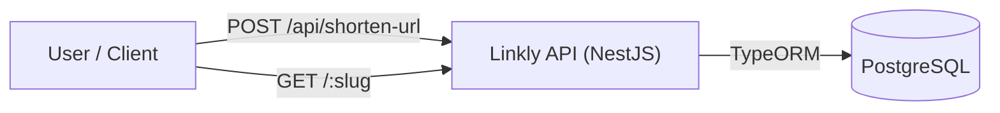
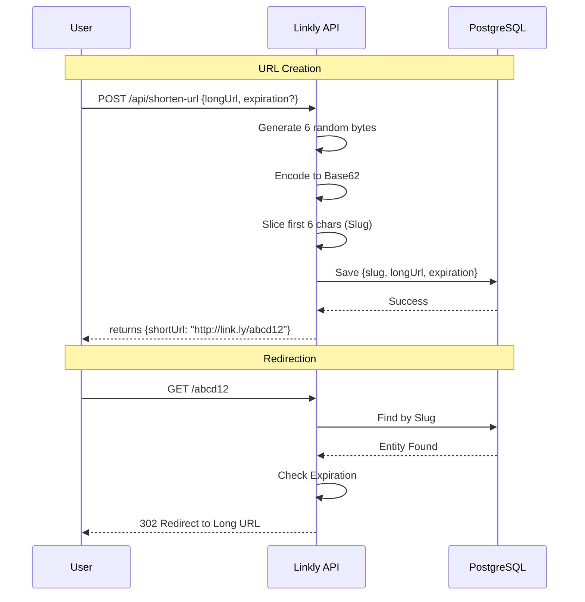

# Linkly - URL Shortener

Linkly is a URL shortener that converts long, cumbersome links into unique, 6-character slugs for easy sharing. It exists to provide a reliable, scalable, and developer-friendly way to manage link redirection with built-in expiration.

### System Architecture



### Action Flow



## 🛠 Tech Stack Decisions

### NestJS & PostgreSQL

- **NestJS**: Chosen for its "batteries-included" approach, providing a robust modular architecture that scales with complexity. Its built-in support for TypeScript, dependency injection, and standardized exception handling ensures a high-quality, maintainable codebase.
- **PostgreSQL**: Selected for its reliability, mature ecosystem, and strong indexing support. A relational model fits URL mapping well (short URL → long URL), enforces constraints like uniqueness, and keeps queries predictable as data grows. Compared to document databases, it simplifies lookups, guarantees consistency during writes, and supports efficient indexing for high-traffic redirects

### Slug Generation Strategy

We use `crypto.randomBytes(6)` → `Base62 Encoding` → `Take first 6 characters`.

- **Entropy**: Generating 6 random bytes provides over **281 trillion** possible permutations ($256^6$), significantly reducing the risk of collisions compared to sequential counters.
- **Base62**: Uses `0-9`, `a-z`, and `A-Z`, offering a human-friendly character set that is URL-safe and compact.
- **Collision Resistance**: Unlike sequential IDs, this random approach prevents "ID crawling" and ensures the short URL remains opaque and secure.

## 📡 Endpoint Structure

- **`POST /api/shorten-url`**: The creation endpoint is prefixed with `/api` to clearly separate management actions from the redirection service. This follows REST best practices for administrative/functional APIs.
- **`GET /:slug`**: Redirection happens at the **root level** to keep the shortened URLs as short as possible (e.g., `link.ly/xY3z8A` instead of `link.ly/api/shorten-url/xY3z8A`).

## 🚀 Getting Started

```bash
# install dependencies
$ pnpm install

# run migrations
$ pnpm migration:run

# start in development
$ pnpm run dev
```

## 🧪 Testing

```bash
# unit tests
$ pnpm run test

# e2e tests
$ pnpm run test:e2e
```
